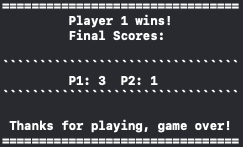
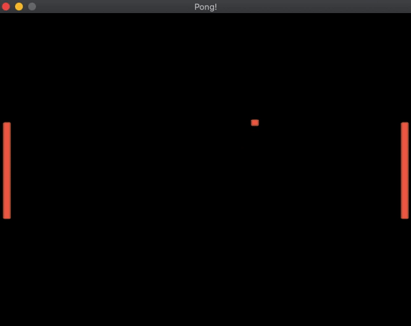
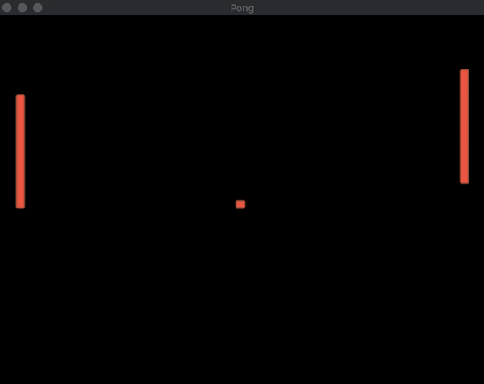
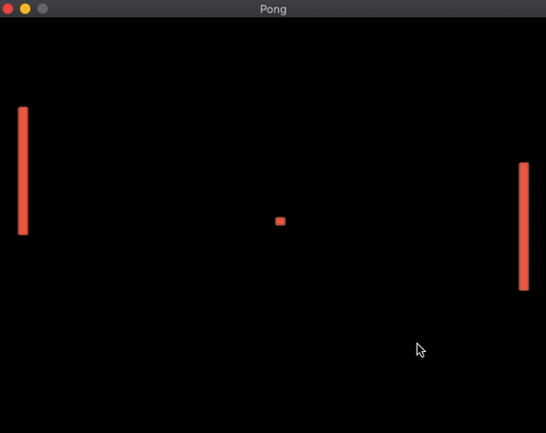
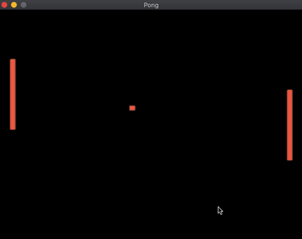

# Instructions
Make Pong!
- Needs a paddle on each side that can move individually.  
- Needs an object that bounces off of the paddles and top/bottom wall  
- Does not need to keep score but must detect when someone wins.  
- Can use images or untextured polygons. 
- Can use keyboard, mouse or joystick input.  
- You can have both players using the keyboard if you want. 

# Demo
#### *Huzzah! It works!*
| <ul> <li> Player 1: `W + S keys` </li> <li> Player 2: `Up + Down` Arrow Keys </li> <li> `Space` to start </li> <li> First to 3 points wins! </li> </ul> |  |
| :- | - |

# Bloopers
|  |  | 
| :-: | :-: |
| *Not a Bounce* | *Decision Anxiety* |
|  |  |
 | *Rebellion* | *Paddle Fear* |

> S/o to [this website](https://ezgif.com/video-to-gif/) for making gif generation super easy
