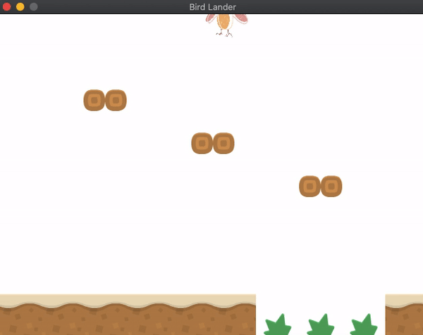
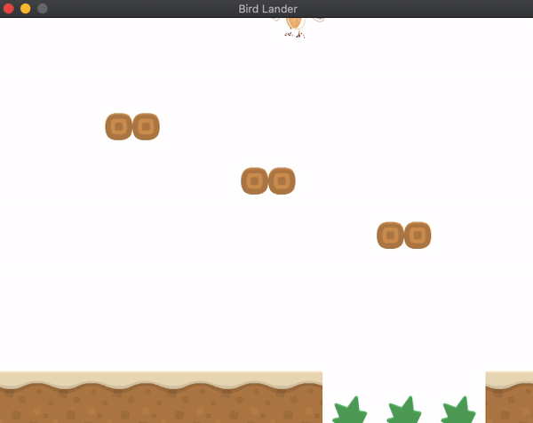
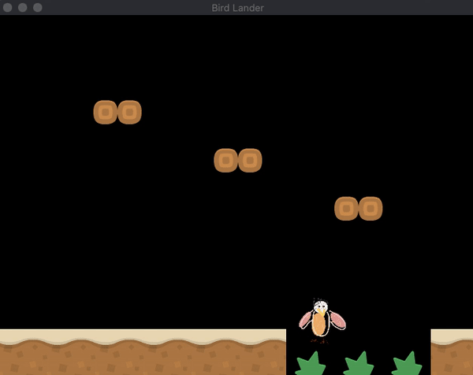

# Instructions
Make a simple version of Lunar Lander:
- The player should fall with gravity (make it very low so it moves slowly). ✔
- Moving left and right should change acceleration instead of velocity. ✔
- If the player touches a wall/rock show text “Mission Failed” ✔
- If the player touches the platform show  text “Mission Successful” ✔
- You can use whatever graphics/theme as long as you meet the requirements. ✔

# Demo
| Pass | Fail |
| :-: | - |
 |  |

# Bloopers
*Glad we got past this*   

  
