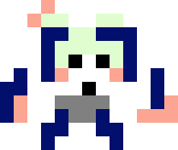

> **Note: As of 4/21, assignment is still in progress. Thank you!**

# Instructions
Make a platformer game!

- Menu Screen
  - Show the name of the game. Press enter to start.
- GamePlay
  - 3 Levels. They do not need to be long or complicated!
  - 3 Lives. If player runs out of lives, show “You Lose”
  - If they get to the end show “You Win”
  - At least 1 type of moving AI  (place a couple of these AI in your game)
  - If the player touches the AI the player dies (you can do collidedBottom kill if you want). 
  - At least 1 looping background music, and at least 1 sound effect.

# Audio Credits
Background Music: [*KK I THINK - Tyler, the Creator KK Slider Cover*](https://www.youtube.com/watch?v=G-g84zoFkYQ) by [Gunk](https://www.youtube.com/channel/UCA1TbpsMa9_iPTmKn0qd_bg) on YouTube

Jumping sound effect: [*Spin Jump Sound*](http://soundbible.com/1898-Spin-Jump.html) from [SoundBible](http://soundbible.com/)

# Demo
*In Progress* 

| The Villian |
| - |
|  |
| *s/o to [this site](https://make8bitart.com/)* |

|  |  |  |
| - | - | - |
|  |  |  |

Remaining Tasks:
- Adding music
- Adding AI
- Fixing `lives` bug

# Bloopers

