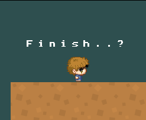
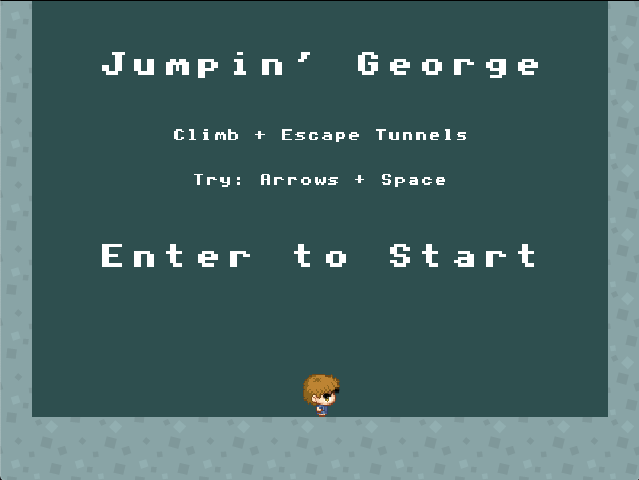
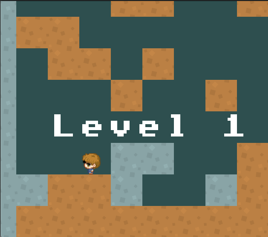
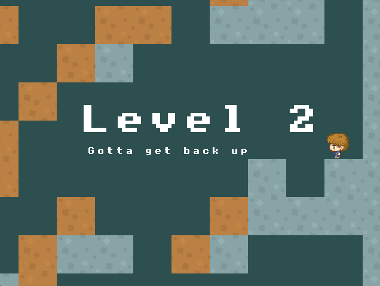
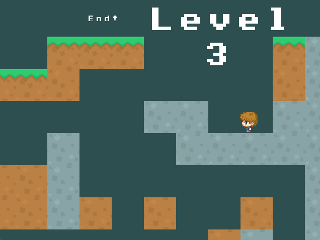
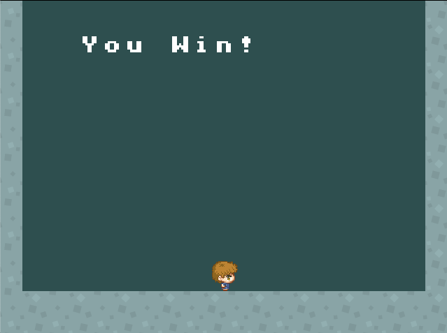
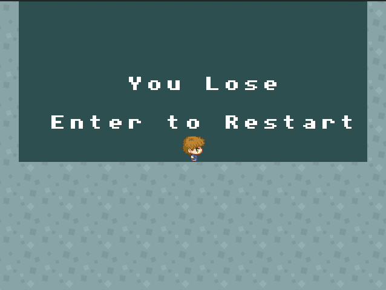
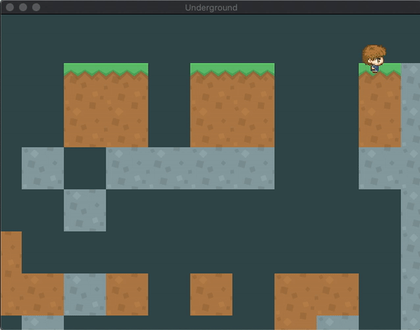
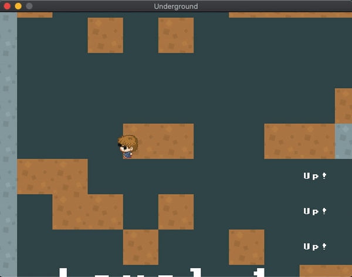

# Instructions
Make a platformer game!

- Menu Screen
  - Show the name of the game. Press enter to start.
- GamePlay
  - 3 Levels. They do not need to be long or complicated!
  - 3 Lives. If player runs out of lives, show “You Lose”
  - If they get to the end show “You Win”
  - At least 1 type of moving AI  (place a couple of these AI in your game)
  - If the player touches the AI the player dies (you can do collidedBottom kill if you want). 
  - At least 1 looping background music, and at least 1 sound effect.

# Jumpin' George
In this game, I wanted to challenge myself to implement a sidescrolling effect both when the player moved and jumped. In this game, George (now decked out in cool sunglasses) has to work his way out of an underground maze full of evil AIs. 

| Cool George | The Villian |
| :-: | :-: |
|  |    *s/o to [this site](https://make8bitart.com/)* |

George is a peaceful boy, and is unarmed. To defeat the enemies, he must trick them into falling into holes. Despite living in an underground maze, they do not know how to jump or climb.

As George accends to the top of each level, the scenery changes from soil to rock and finally, to grass! 

# Demos
|  |
| :-: |
| *Final demo ft. slothy frame rate* |

### Featured Screenshots
|  |  |  |
| - | - | - |
|  |  |  |

# Audio Credits
Background Music: [*KK I THINK - Tyler, the Creator KK Slider Cover*](https://www.youtube.com/watch?v=G-g84zoFkYQ) by [Gunk](https://www.youtube.com/channel/UCA1TbpsMa9_iPTmKn0qd_bg) on YouTube

Jumping sound effect: [*Spin Jump Sound*](http://soundbible.com/1898-Spin-Jump.html) from [SoundBible](http://soundbible.com/)

# Bloopers
|  |  |
| - | - |
