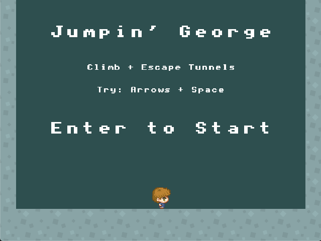
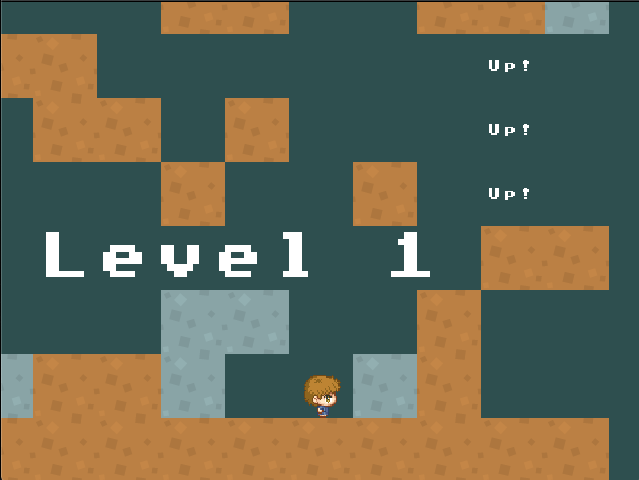
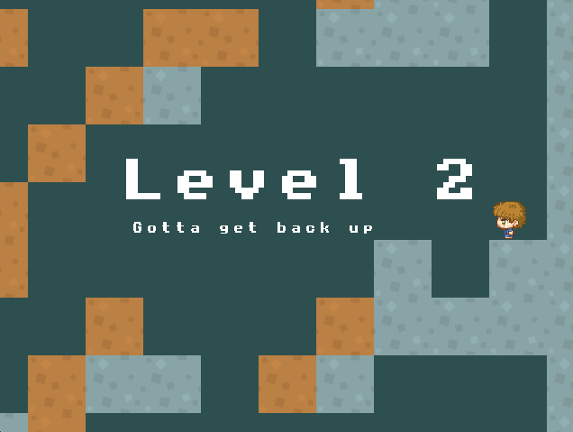
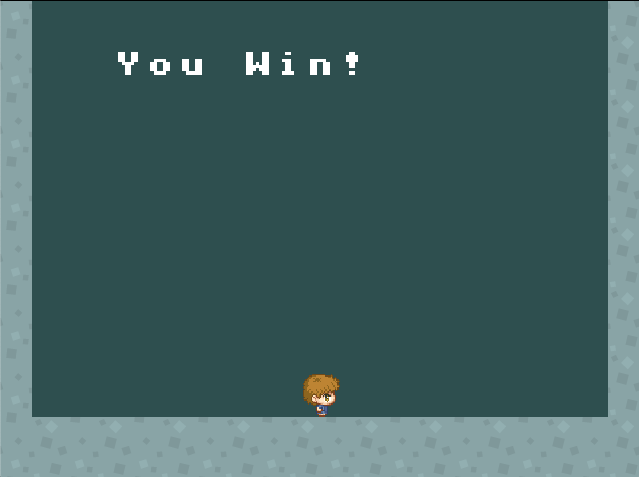
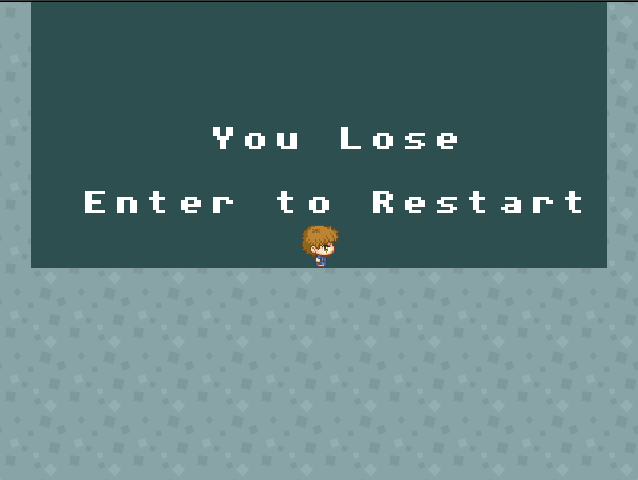
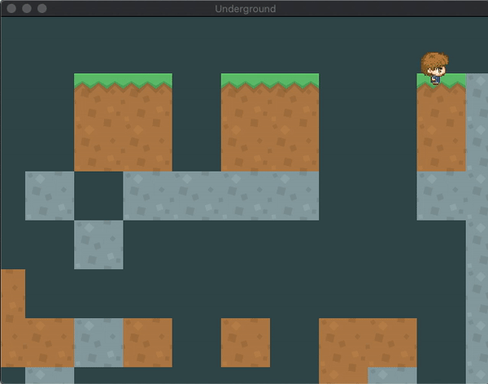

# Instructions
Make a platformer game!

- Menu Screen
  - Show the name of the game. Press enter to start.
- GamePlay
  - 3 Levels. They do not need to be long or complicated!
  - 3 Lives. If player runs out of lives, show “You Lose”
  - If they get to the end show “You Win”
  - At least 1 type of moving AI  (place a couple of these AI in your game)
  - If the player touches the AI the player dies (you can do collidedBottom kill if you want). 
  - At least 1 looping background music, and at least 1 sound effect.

# Demo
*In Progress*

|  |  |  |
| - | - | - |
|  |  |  |

Remaining Tasks:
- Adding music
- Adding AI
- Fixing `lives` bug

# Bloopers

