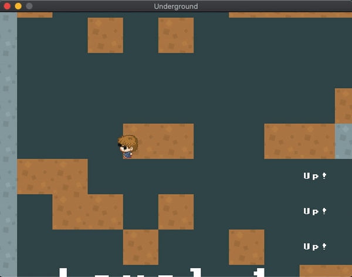

### Final [Commit](https://github.com/mkarroqe/CS3113/commit/cfc5bfcd1a76df643c7e8c30c8d7985fb66ff066) for Submission: 4/21 11:44pm

> Status:
>  - Ais are invisible :(
>  - if you hit them (coordinates visible in console) you do lose lives however! [demo here](https://github.com/mkarroqe/CS3113/blob/master/05-Platformer/demos/demo-lives-ai.mov)
>
> *All other tasks are completed!*

# Instructions
Make a platformer game!

- Menu Screen
  - Show the name of the game. Press enter to start.
- GamePlay
  - 3 Levels. They do not need to be long or complicated!
  - 3 Lives. If player runs out of lives, show “You Lose”
  - If they get to the end show “You Win”
  - At least 1 type of moving AI  (place a couple of these AI in your game)
  - If the player touches the AI the player dies (you can do collidedBottom kill if you want). 
  - At least 1 looping background music, and at least 1 sound effect.

# Demos
Full Run, Winning Screen with losing two lives falling in pits [here](https://github.com/mkarroqe/CS3113/blob/master/05-Platformer/demos/full-demo-win.mov)

Full Run, losing by falling in pits [here](https://github.com/mkarroqe/CS3113/blob/master/05-Platformer/demos/demo-lose.mov)
> These are both videos that require downloading them to view.

|  |  |  |
| - | - | - |
|  |  |  |

| The (Invisible) Villian |
| - |
|  |
| *s/o to [this site](https://make8bitart.com/)* |

# Audio Credits
Background Music: [*KK I THINK - Tyler, the Creator KK Slider Cover*](https://www.youtube.com/watch?v=G-g84zoFkYQ) by [Gunk](https://www.youtube.com/channel/UCA1TbpsMa9_iPTmKn0qd_bg) on YouTube

Jumping sound effect: [*Spin Jump Sound*](http://soundbible.com/1898-Spin-Jump.html) from [SoundBible](http://soundbible.com/)

# Bloopers
|  |  |
| - | - |
