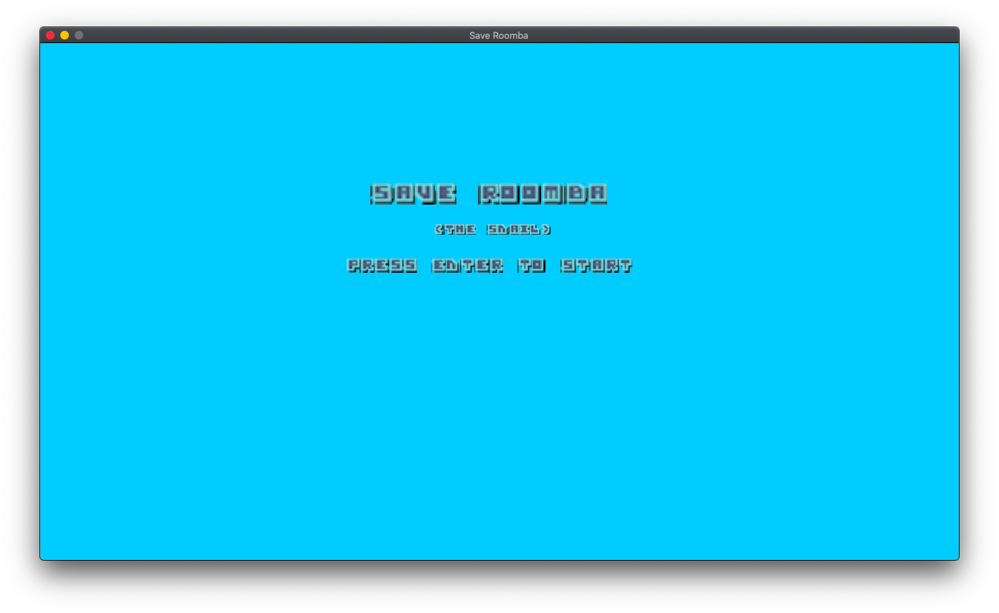
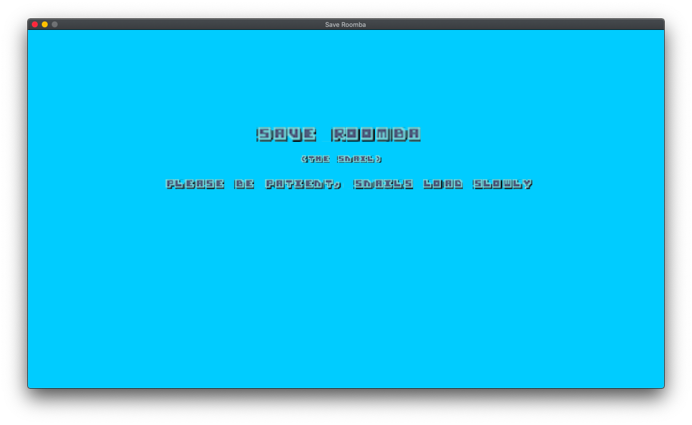
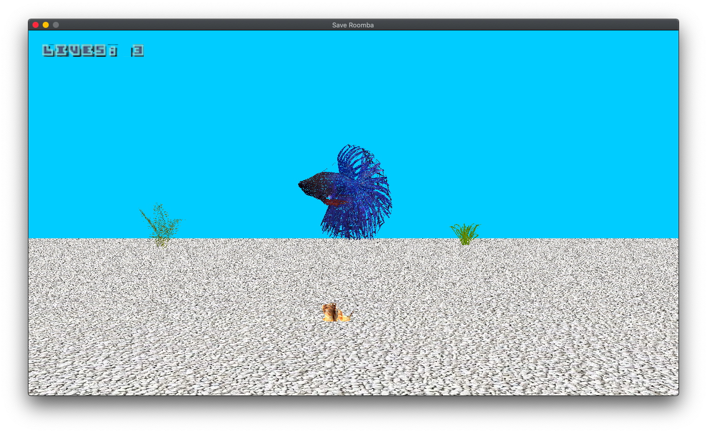
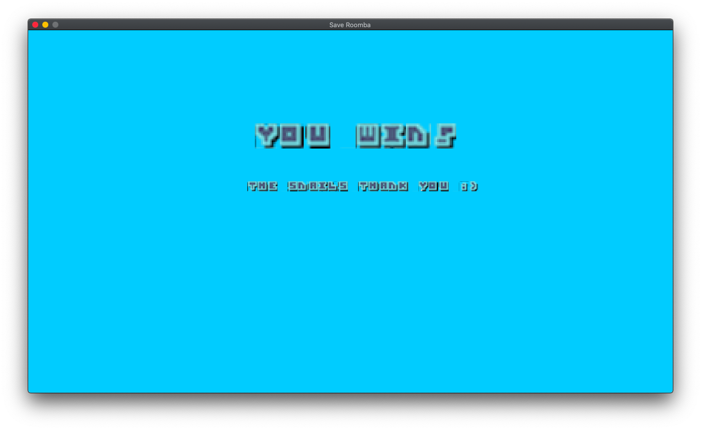
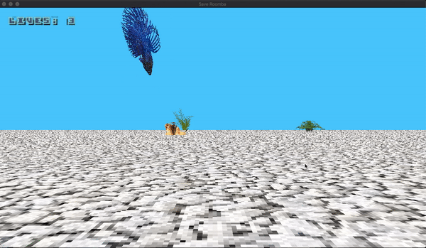

# Instructions
Make a game in the style of your choice (2D or 3D). No 2D Platformers or extensions of the previous project. If you are making a 2D game it needs to be something other than a platformer. It can be a top down game for instance, or other style of 2D game. A 3D platformer is OK! You must use new assets (art, music, sound) for this project. No Good/Evil Professor Carmines. No using George or anything from the lectures.

### Requirements:
- Menu Screen: Show the name of the game. Press enter to start.
- About 2 Minutes of Gameplay. (can be 1 giant level, multiple levels, etc.)
- Some sort of moving AI
- Some way for the player to lose (touching an AI, falling off a ledge, running out of time).
- Some way for the player to win (killing all the AI, collecting all the coins, whatever you want).
- At least 1 looping background music, and at least 1 sound effect.

# Controls
| Key | Function |
| :-: | :-: |
| `Enter` | Start Game |
| `WASD` | Orbit Scene |
| `Arrow Keys` | Move snail |
| `Right Shift` | Climb up a wall |
| `Left Shift` | Climb down a wall |

> Once the snail is up a wall, it will only move along the y-axis. To move along other axis, return to the aquarium floor by holding down `LSHIFT`.

# Demo
> *Detailed breakdown and more [here](more-deets.md#completed-tasks)*

|  |  |
| - | - |
|  |  |

# Asset Credits
## Music
Original music by [Charlie Reynolds](https://soundcloud.com/saxyjew).

## Font
[Small Blocky Font](https://opengameart.org/content/small-blocky-font) by [Jerom](https://opengameart.org/users/jerom) via [`OpenGameArt.org`](https://opengameart.org/).

## Graphics
|  |  |  |
| :-: | :-: | :-: |
| [Betta](https://free3d.com/3d-model/crowntailbetta-v1--31129.html) | [Snail](https://free3d.com/3d-model/snail-23158.html) | [Grass](https://free3d.com/3d-model/high-quality-grass-78178.html) |
|  |  |  |
| [Palm](https://free3d.com/3d-model/palm-54462.html) | [Fern](https://free3d.com/3d-model/-fern-v2--65217.html) | [Gravel](https://www.pinterest.com/pin/353814114473920228/) |

# Inspiration
| My late aquatic children, Roomba the snail and Emo the betta. |  |
| - | - |

# Bloopers
|  |  |
| - | - |
