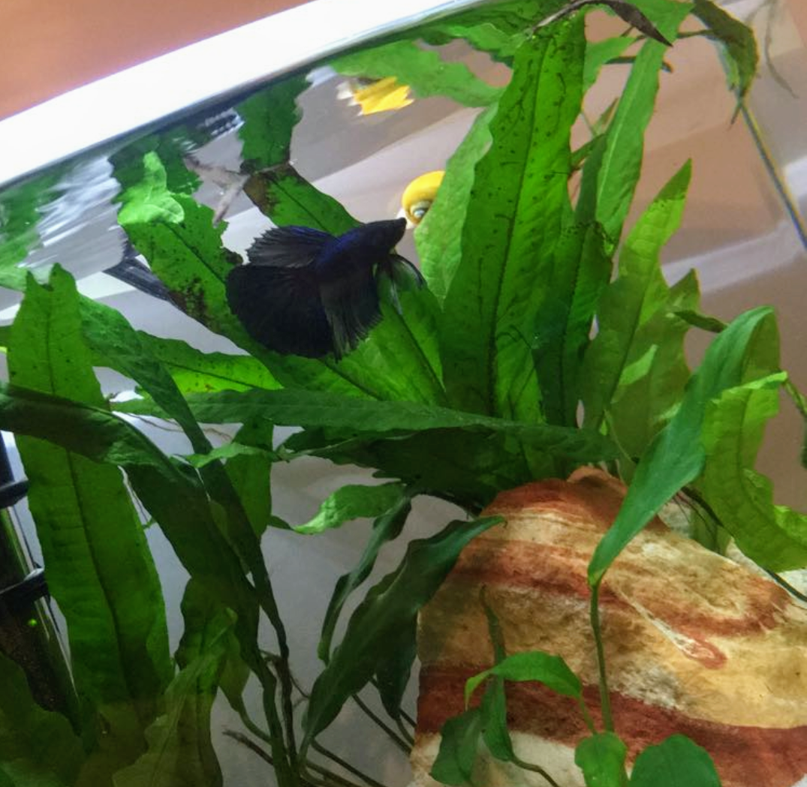

# Instructions
Make a game in the style of your choice (2D or 3D). No 2D Platformers or extensions of the previous project. If you are making a 2D game it needs to be something other than a platformer. It can be a top down game for instance, or other style of 2D game. A 3D platformer is OK! You must use new assets (art, music, sound) for this project. No Good/Evil Professor Carmines. No using George or anything from the lectures.

### Requirements:
- Menu Screen: Show the name of the game. Press enter to start.
- About 2 Minutes of Gameplay. (can be 1 giant level, multiple levels, etc.)
- Some sort of moving AI
- Some way for the player to lose (touching an AI, falling off a ledge, running out of time).
- Some way for the player to win (killing all the AI, collecting all the coins, whatever you want).
- At least 1 looping background music, and at least 1 sound effect.

# Asset Credits
|  |  |
| :-: | :-: |
| [Betta](https://free3d.com/3d-model/crowntailbetta-v1--31129.html) | [Snail](https://free3d.com/3d-model/snail-23158.html) |

WIP List:
- [gravel2.jpg](https://www.pinterest.com/pin/353814114473920228/)
- [gravel.jpg](http://naturesocean.com/aquarium-supplies/Snow-White-Aquarium-Gravel.html)
- [grass](https://free3d.com/3d-model/high-quality-grass-78178.html)
- [palm](https://free3d.com/3d-model/palm-54462.html)
- [fern](https://free3d.com/3d-model/-fern-v2--65217.html)

# Inspiration
| My late aquatic children, Roomba the snail and Emo the betta. |  |
| - | - |

# Demo
*in progress*
